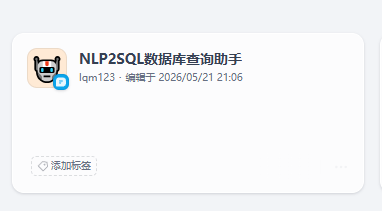
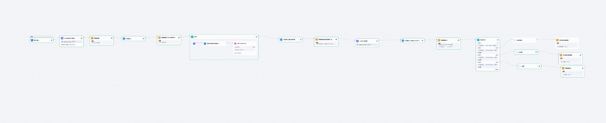
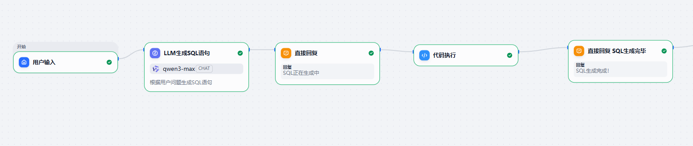
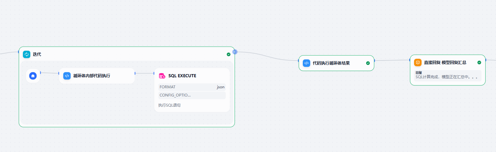
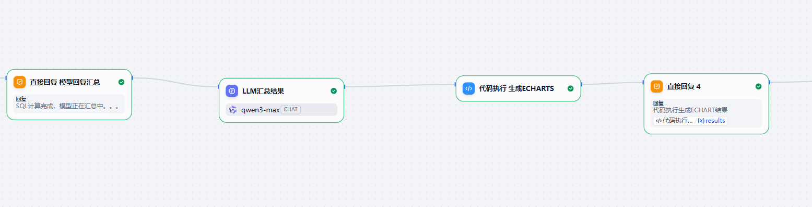
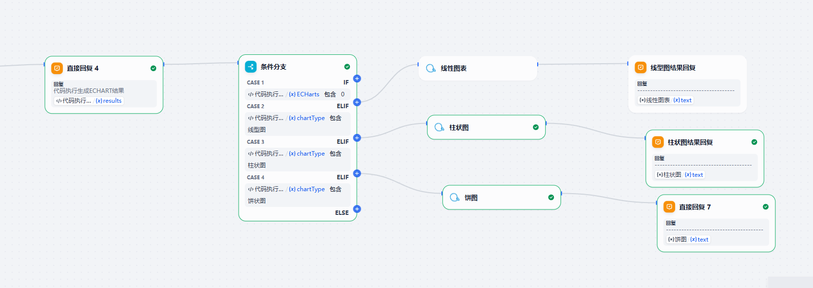
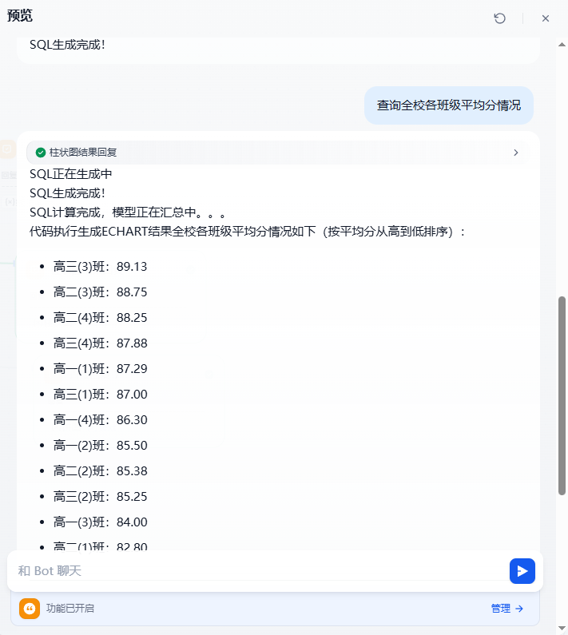
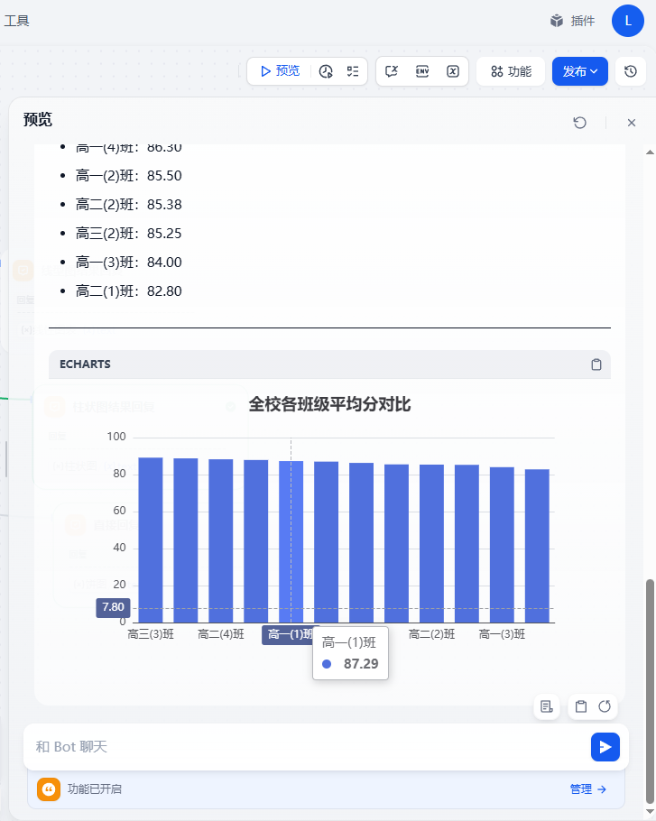
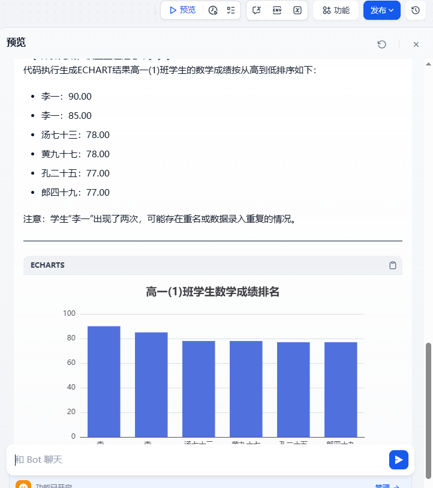

# NLP2SQL 数据库查询助手 Dify 工作流

这是 `NLP2SQL数据库查询助手` 的 GitHub 项目，用于存放 Dify 应用 DSL、工作流截图和效果展示图片。


## 项目文件


```text
.
├── README.md
├── dsl/
│   └── nlp2sql-assistant.yml     # Dify DSL 文件
└── assets/
    ├── app-home.png              # 应用首页截图
    ├── workflow-canvas.png       # 工作流编排截图
    ├── query-demo.png            # 自然语言查询效果截图

```

## 应用简介

应用名称：`NLP2SQL数据库查询助手`

应用类型：Dify 应用 / 工作流应用

项目目标：让用户通过自然语言描述查询需求，由助手理解问题、生成或辅助生成 SQL，并返回数据库查询结果或查询建议。

## 预期能力

- 理解用户自然语言查询意图。
- 识别涉及的数据表、字段和筛选条件。
- 根据问题生成 SQL 查询语句。
- 执行或辅助执行数据库查询。
- 对查询结果进行自然语言解释。
- 对复杂问题给出澄清提示或查询建议。

## 典型使用场景

- 业务人员用自然语言查询数据。
- 数据分析场景下快速生成 SQL。
- 数据库表结构问答。
- 查询结果解释与总结。
- 企业内部数据助手原型演示。

## DSL 文件位置


> 注意：请不要提交数据库密码、API Key、Token 等敏感信息。如果 DSL 中包含敏感配置，请先脱敏后再上传。

## 图片展示


### 应用首页截图



### 工作流编排截图







### 自然语言查询效果截图







## 配置提醒

导入后通常需要重新配置：

- 大模型供应商与模型名称
- 数据库连接信息
- 工具或插件权限
- 环境变量
- API Key / Token
- SQL 执行安全策略


